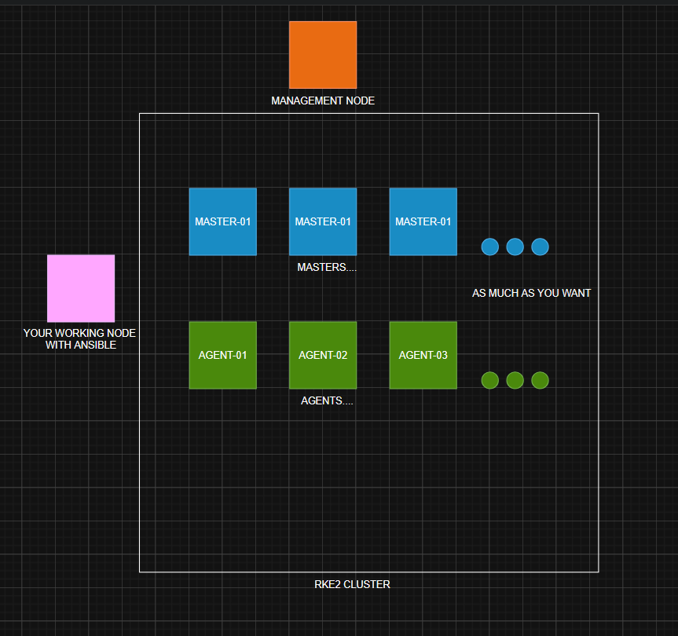
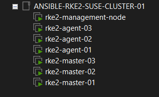
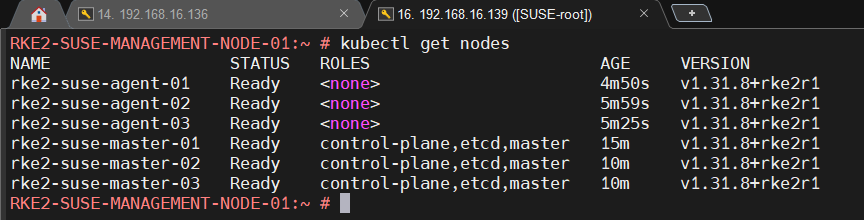

# 🚀 RKE2 Deployment on SUSE with Ansible

This project provides an automated solution for deploying a highly available [RKE2](https://docs.rke2.io/) (Rancher Kubernetes Engine 2) cluster using [Ansible](https://www.ansible.com/) on **SUSE Linux Enterprise** or **openSUSE Leap** systems. [SUSE](https://www.suse.com/)


## ⚠️ Preamble

This is a **demo project** for deploying an RKE2 cluster on SUSE Linux using an Ansible playbook with a **single command**. It's built for those — like me — who don’t want to rely on temporary live labs for learning or testing.

Wouldn’t it be great to have your own reliable, secure lab up and running in just two clicks?

Although this setup is intended for lab environments, **the playbook does not disable firewalls** for security reasons. Everything is designed to work out of the box with minimal manual intervention. Enjoy fast, repeatable deployments for learning and testing purposes!


---

## 📌 Features

- 🧩 Modular Ansible roles for management, master, and agent nodes
- 🔁 Reusable playbooks for shutdown, reboot, IP configuration, and more
- ⚙️ Easy-to-configure inventory file
- 🐧 SUSE Linux compatible

---

## 🖼️ Architecture Overview

> _Example: 3 master nodes, 3 agent nodes, 1 management node_







---


## 🧰 Prerequisites

- **This Project assume you already have some Deployed VMs with ssh access**
- **Static IP** on each VMs, very important for cluster, becouse there are no DNS server for this lab
- Ansible installed on the management host
- **SSH access** from the management node to all cluster nodes
- Key-based SSH authentication configured
- All nodes running SUSE Linux (Leap or SLES)
- Python installed on all target machines

---

## 📁 Project Structure


```
rke2-deployment/
├── ansible.cfg
├── hosts.ini
├── playbooks
│   ├── ping-all.yml
│   ├── playbook.yml
│   ├── reboot-all-hosts.yml
│   ├── replace-dhcp-to-static-ip.yml
│   └── shutdown-all-hosts.yml
└── roles
    ├── agent
    │   └── tasks
    │       └── main.yml
    ├── common
    │   └── tasks
    │       └── main.yml
    ├── management
    │   └── tasks
    │       └── main.yml
    └── master
        └── tasks
            └── main.yml
```

---


## 📟 How to Use
1. Clone the Repository and enter project directory
```bash
git clone https://github.com/levrskn/rke2-deployment-on-suse.git
cd rke2-deployment-on-suse
```
2. Create and copy ssh keys of management node to all remote servers
```bash
ssh-keygen -t rsa -b 4096
ssh-copy-id root@192.168.1.100
ssh-copy-id root@192.168.1.101
ssh-copy-id root@192.168.1.200
ssh-copy-id root@192.168.1.201
ssh-copy-id root@192.168.1.10
#rest of your servers here....
```
3. Edit hosts.ini:
```bash
[masters]
192.168.1.100
192.168.1.101
#rest of the masters IPs down here...

[agents]
192.168.1.200
192.168.1.201
#rest of the agents IPs down here...

[managements]
192.168.1.10
#This is the management node to manage the cluster with kubectl and not from master nodes for security reasons

[all:vars]
ansible_user=root
# remote user to use for ansible. you may want to create separate user just for ansible to see afterall what has been done.

ansible_python_interpreter=/usr/bin/python3.6
#Right for now, official SUSE Leap 15.6 supports python 3.6.15

ansible_ssh_private_key_file=~/.ssh/id_rsa 
# you may want not to use this way with ssh keys, but add --ask-become once while running ansible-playbook
```

4. Run connectivity test
```bash
ansible-playbook ./playbooks/ping-all.yml
```

5. Deploy the RKE2 cluster
```bash
ansible-playbook ./playbooks/rke2-deployment.yml
```
6. Now this is time to connect to management node via ssh and start use your just baked RKE2 cluster!
```bash
ssh root@<management-node-id>
kubectl get nodes
kubectl get pods -A
```


## 📃 License
GPL-3.0 license [©levrskn](https://github.com/levrskn)

---

## 💾  Author

Me on [GitHub](https://github.com/levrskn)

Me on [LinkedIn](https://linkedin.com/in/levrskn)
